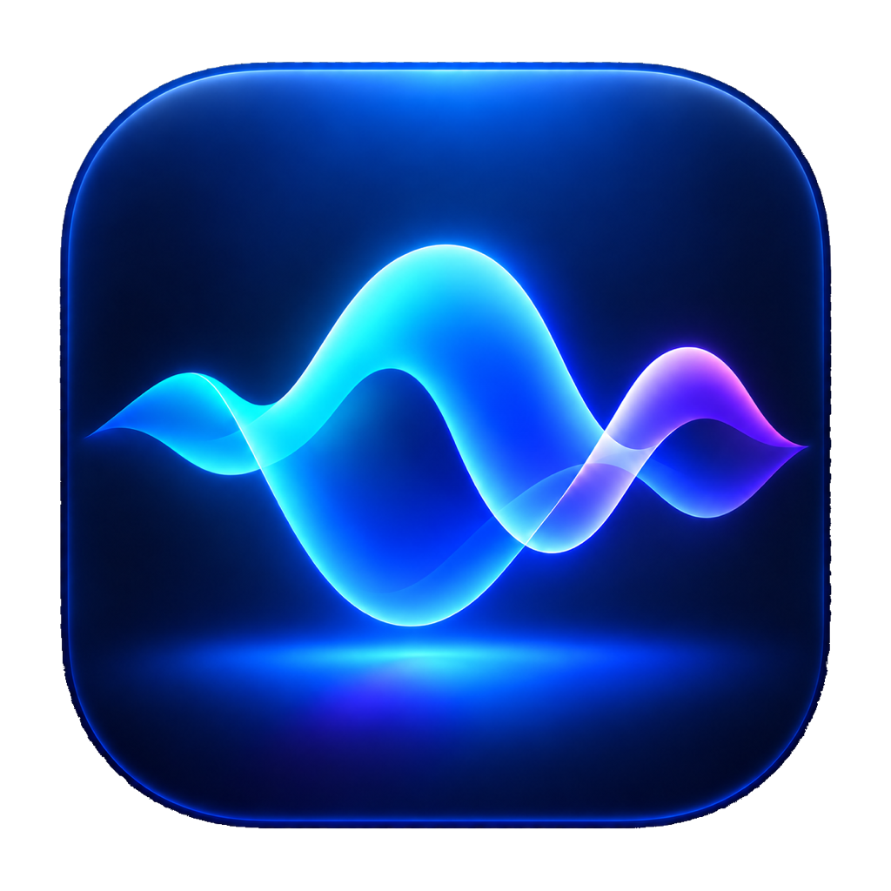
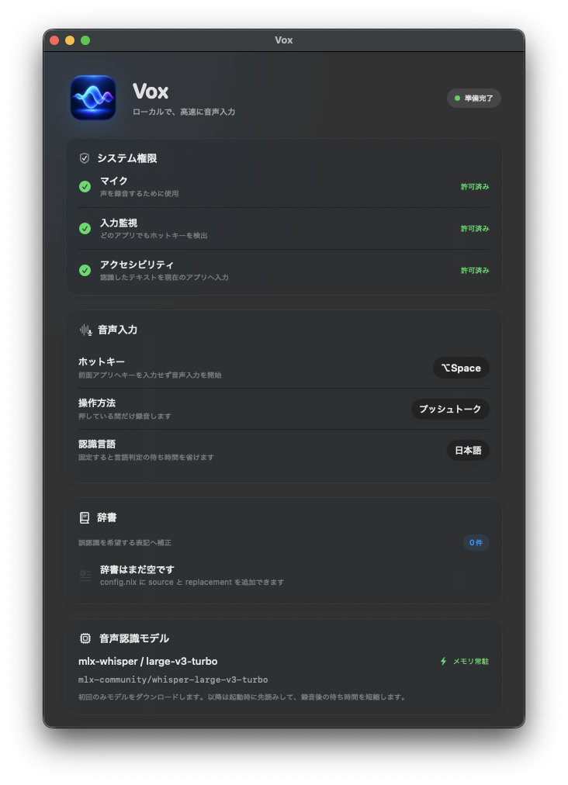
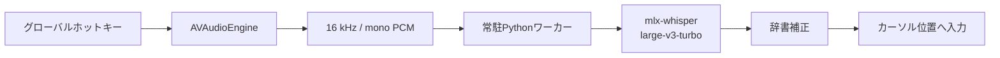

> 本リポジトリはsatomi1224の個人利用を想定して作成されています。予期せぬ変更や不具合が追加されることが想定されますがご容赦ください。

<p align="center">
  
</p>

<h1 align="center">Vox</h1>

<p align="center">
  Apple Silicon Macのための、高速・ローカルな音声入力アプリ
</p>

<p align="center">
  
  
  
  <a href="./LICENSE"></a>
</p>

<p align="center">
  
</p>

Voxは、任意のアプリで使えるmacOSメニューバー常駐型の音声入力アプリです。ホットキーを押して話すと、`mlx-whisper`と`large-v3-turbo`がMac上で音声を文字に変換し、現在のカーソル位置へ入力します。

モデルの初回ダウンロードを除き、録音・推論・辞書補正はローカルで完結します。設定はNixで宣言的に管理でき、nix-darwinとHome Managerのどちらからでも導入できます。

> [!IMPORTANT]
> 対応環境はApple Silicon搭載Mac、macOS 14以降、Flakesを有効にしたNixです。Intel Mac、Linux、Nixを使わないインストールは現在サポートしていません。

## 目次

- [主な機能](#主な機能)
- [必要環境](#必要環境)
- [クイックスタート](#クイックスタート)
- [Dotfilesから導入](#dotfilesから導入)
- [macOSの初期設定](#macosの初期設定)
- [使い方](#使い方)
- [設定](#設定)
- [仕組みと高速化](#仕組みと高速化)
- [プライバシー](#プライバシー)
- [トラブルシューティング](#トラブルシューティング)
- [開発](#開発)
- [制約事項](#制約事項)

## 主な機能

- `⌥Space`を初期値とする、変更可能なグローバルホットキー
- ホットキーを前面アプリへ入力させないキーイベント抑止
- 押している間だけ録音する「プッシュトーク」
- 押すたびに録音開始・停止を切り替える「トグル」
- 録音音量に反応するフローティング波形UI
- `mlx-whisper`と`mlx-community/whisper-large-v3-turbo`によるオンデバイス文字起こし
- モデルを保持する常駐ワーカーによる、2回目以降の低レイテンシ化
- 読みや誤認識を希望表記へ直すユーザー辞書
- ホットキー、入力方式、言語、モデル、辞書のNix管理
- nix-darwin / Home Managerモジュール
- モデル準備状態、文字起こし状態、キャンセル操作の表示
- 二重起動と孤立ワーカープロセスの防止
- アクセシビリティ未許可時のクリップボードフォールバック

## 必要環境

| 項目 | 要件 |
| --- | --- |
| Mac | Apple Silicon（M1以降） |
| OS | macOS 14以降 |
| Nix | Flakesが利用可能なNix |
| ネットワーク | Nix依存関係と初回モデル取得時のみ必須 |
| 空き容量 | モデルキャッシュ用に少なくとも約2 GBを推奨 |

初回起動時に[`mlx-community/whisper-large-v3-turbo`](https://huggingface.co/mlx-community/whisper-large-v3-turbo)を取得します。モデル本体は約1.6 GBです。取得後はHugging Faceのローカルキャッシュが再利用されます。

## クイックスタート

公開flakeを直接起動できます。

```sh
nix run github:satomi-1224/vox
```

初回はNixパッケージの準備とモデルのダウンロードが行われます。設定画面でmacOSの権限を許可し、メニューバーにVoxが表示されたら利用できます。

継続利用では、次のDotfiles統合を推奨します。

## Dotfilesから導入

### 1. flake inputを追加

既存の`flake.nix`へ追加します。`nixpkgs.follows`を指定すると、普段の環境と同じnixpkgsを利用できます。

```nix
inputs.vox = {
  url = "github:satomi-1224/vox";
  inputs.nixpkgs.follows = "nixpkgs";
};
```

### 2-A. nix-darwin

既存の`darwinSystem.modules`へVoxモジュールを追加します。

```nix
modules = [
  inputs.vox.darwinModules.default

  {
    programs.vox = {
      enable = true;

      # 省略した項目には既定値が使われます。
      settings = {
        hotkey = {
          key = "space";
          modifiers = [ "option" ];
        };
        inputMode = "pushToTalk";
        language = "ja";
        dictionary = [
          { source = "えむえるえっくす"; replacement = "MLX"; }
          { source = "ぼっくす"; replacement = "Vox"; }
        ];
      };
    };
  }
];
```

通常どおり構成を反映し、最初の一度だけ`vox`を起動します。

```sh
darwin-rebuild switch --flake .
vox
```

### 2-B. Home Manager

Home Manager単体でも同じ`programs.vox`設定を利用できます。

```nix
imports = [ inputs.vox.homeManagerModules.default ];

programs.vox = {
  enable = true;
  settings.dictionary = [
    { source = "えーぴーあい"; replacement = "API"; }
  ];
};
```

```sh
home-manager switch --flake .
vox
```

### モジュールを使わず導入

パッケージを直接追加することもできます。この場合はVoxリポジトリの既定設定が使われます。

```nix
environment.systemPackages = [
  inputs.vox.packages.aarch64-darwin.default
];
```

Home Managerでは`home.packages`へ同じパッケージを追加してください。

## macOSの初期設定

Voxは次の3つのシステム権限を使用します。

| 権限 | 用途 |
| --- | --- |
| マイク | 音声を録音する |
| 入力監視 | 他のアプリを使用中でもグローバルホットキーを検出する |
| アクセシビリティ | 認識結果を現在のアプリへ`⌘V`で入力する |

1. Voxを起動します。
2. 設定画面の「許可する」を押します。
3. システム設定でVoxを有効にします。
4. 入力監視が有効にならない場合は、メニューバーからVoxを完全に終了して`vox`で起動し直します。

Nixでは更新のたびに`.app`のストアパスが変わります。Voxは権限を更新後も引き継げるよう、`com.satomi.vox`を用いた固定ローカル署名要件でアドホック署名されています。Developer ID署名やAppleの公証を行った配布バイナリではありません。

## 使い方

### プッシュトーク

既定の動作です。

1. `⌥Space`を押し続けます。
2. 波形が表示されたら話します。
3. キーを離すと文字起こしが始まります。
4. 認識結果が現在のカーソル位置へ入力されます。

ホットキーに使ったキーイベントはVoxが消費するため、前面アプリへSpaceなどが連続入力されることはありません。

### トグル

`inputMode = "toggle";`にすると、ホットキーを1回押して録音開始、もう1回押して録音停止になります。

### メニューバー

メニューバーから次の操作ができます。

- 音声入力の開始・停止
- 実行中の文字起こしのキャンセル
- 現在状態とホットキーの確認
- 設定画面を開く
- About画面を開く
- Voxを終了する

設定画面を閉じてもアプリはメニューバーに常駐します。

### 認識結果の入力

Voxは認識結果を一時的にクリップボードへ置き、`⌘V`を送信して入力します。入力後、クリップボードが他のアプリによって変更されていなければ以前の内容を復元します。

アクセシビリティが未許可の場合、認識結果は貼り付けずクリップボードへ残します。

## 設定

すべてのアプリ設定はNixで管理します。設定画面は現在適用中の値を確認するための読み取り専用UIです。

### 設定可能項目

| オプション | 型 / 値 | 既定値 | 説明 |
| --- | --- | --- | --- |
| `programs.vox.enable` | boolean | `false` | Voxをインストールする |
| `programs.vox.package` | package | Vox標準パッケージ | 使用するoverride可能なパッケージ |
| `settings.hotkey.key` | string または `null` | `"space"` | 名前で指定するキー |
| `settings.hotkey.keyCode` | integer または `null` | `null` | macOS仮想キーコードによる指定 |
| `settings.hotkey.modifiers` | string list | `[ "option" ]` | 同時に押す修飾キー |
| `settings.inputMode` | `"pushToTalk"` / `"toggle"` | `"pushToTalk"` | 録音の開始・停止方式 |
| `settings.language` | `"ja"` / `"en"` / `"auto"` | `"ja"` | Whisperの認識言語 |
| `settings.model` | string | `"mlx-community/whisper-large-v3-turbo"` | 使用するHugging Faceモデル |
| `settings.dictionary` | attribute set list | `[ ]` | 読み・誤認識と希望表記の組 |

### 完全な設定例

```nix
programs.vox = {
  enable = true;
  settings = {
    hotkey = {
      key = "space";
      keyCode = null;
      modifiers = [ "option" ];
    };

    inputMode = "pushToTalk";
    language = "ja";
    model = "mlx-community/whisper-large-v3-turbo";

    dictionary = [
      {
        source = "えむえるえっくす";
        replacement = "MLX";
      }
      {
        source = "ぼっくす";
        replacement = "Vox";
      }
    ];
  };
};
```

設定変更後は`darwin-rebuild switch`または`home-manager switch`を実行し、起動中のVoxを終了してから再度`vox`を起動してください。

### ホットキー

`hotkey.key`で利用できる名前:

- `space`、`return`、`tab`、`delete`、`escape`
- `a`〜`z`、`0`〜`9`
- `f1`〜`f12`
- `left`、`right`、`up`、`down`
- `period`、`minus`、`equal`

一覧にないキーは`key = null;`にして、`keyCode`へ0〜127のmacOS仮想キーコードを指定できます。`key`と`keyCode`は必ずどちらか一方だけを指定してください。

修飾キーは`command`、`option`、`control`、`shift`、`fn`です。誤操作を防ぐため、`shift`だけの組み合わせは使用できません。少なくとも`command`、`option`、`control`、`fn`のいずれかが必要です。

### 認識言語

- `ja` — 日本語。言語判定を省略するため既定値として推奨
- `en` — 英語
- `auto` — Whisperによる自動判定

### 辞書

辞書は`source`（読み、またはよくある誤認識）と`replacement`（希望する表記）の組です。

```nix
dictionary = [
  { source = "えむえるえっくす"; replacement = "MLX"; }
  { source = "ボックス"; replacement = "Vox"; }
];
```

希望表記は認識時の語彙ヒントとして利用され、認識後にも明示的な置換が行われます。置換は大文字・小文字を区別せず、長い`source`から処理されます。同じ`source`が複数ある場合は先頭が優先されます。

辞書は最大200件です。空文字や不正な形式はNixの評価時に拒否されます。

### リポジトリを直接ビルドする場合

このリポジトリ内では[`config.nix`](./config.nix)が設定元です。

```sh
nix build path:.
open result/Applications/Vox.app
```

別のflakeからパッケージを直接overrideすることもできますが、通常は`programs.vox.settings`の利用を推奨します。

## 仕組みと高速化



- SwiftUI / AppKitでメニューバー、設定画面、フローティングUIを実装
- CGEvent tapでホットキーを検出し、対象キーの押下・リピート・解放を抑止
- AVFoundationで録音時に16 kHz、モノラル、16-bit PCMへ変換
- JSON LinesでSwiftアプリと長寿命Pythonワーカーを接続
- 起動時にモデルを先読みし、録音ごとのPython・モデル再起動を回避
- WAVを直接読み込み、通常の文字起こし経路ではFFmpegプロセスを起動しない
- 無音に近い短い録音は推論前に除外
- アプリ終了時にワーカーも終了する親プロセス監視

## プライバシー

- 録音と推論はMac上で実行されます。
- 音声ファイルは一時ディレクトリへ保存し、文字起こし完了またはキャンセル後に削除します。
- 音声や認識結果を外部APIへ送信する処理はありません。
- アプリ独自のテレメトリーや解析機能はありません。
- 初回モデル取得時はHugging Faceへ接続します。
- テキスト入力時にシステムクリップボードを一時利用します。

## トラブルシューティング

### 入力監視を許可したのにホットキーが反応しない

1. システム設定の「プライバシーとセキュリティ」→「入力監視」でVoxが有効か確認します。
2. メニューバーからVoxを完全に終了します。
3. `vox`で起動し直します。

許可直後はmacOS側がプロセス再起動を要求することがあります。

### 認識結果が入力されない

アクセシビリティ権限を確認してください。未許可でも文字起こしは行われ、結果はクリップボードへ残ります。

### 「モデルを準備中」が長く続く

初回は約1.6 GBのモデルをダウンロードし、その後メモリへ読み込みます。ネットワークと空き容量を確認してください。処理はメニューバーの「文字起こしをキャンセル」から中断でき、取得済みキャッシュは次回に再利用されます。

### 文字起こしをキャンセルしたい

メニューバーから「文字起こしをキャンセル」を選択してください。ワーカーを終了して待機状態へ戻します。

### ホットキーのキーが前面アプリへ入力される

最新のVoxが1つだけ起動していることと、入力監視が有効であることを確認してください。Voxは一致したキーの初回押下、オートリピート、解放をすべて抑止します。

### Nix更新後に権限が外れた

通常は固定署名要件により維持されます。外れた場合は、システム設定から古いVox項目を削除し、新しいVoxを起動して再度許可してください。

## 開発

### 開発シェル

```sh
git clone https://github.com/satomi-1224/vox.git
cd vox
nix develop
swift run Vox
```

`nix develop`はPythonワーカー、モデルID、Nix生成設定への環境変数を用意します。

### テストとビルド

```sh
python3 -m unittest discover -s worker/tests -v
sh scripts/test-swift.sh
swift build -c release
nix flake check path:.
nix build path:.
```

`nix flake check`では、アプリ出力に加えてnix-darwin / Home Managerモジュールの評価も検証します。

### リポジトリ構成

| パス | 内容 |
| --- | --- |
| `Sources/Vox/` | SwiftUI/AppKitアプリ、録音、ホットキー、テキスト入力 |
| `worker/vox_worker.py` | `mlx-whisper`を保持するJSON Linesワーカー |
| `config.nix` | リポジトリを直接ビルドするときの既定設定 |
| `nix/module.nix` | nix-darwin / Home Manager共通モジュール |
| `flake.nix` | Swiftアプリ、Python/MLX環境、`.app`のパッケージング |
| `app/` | Info.plistとアプリアイコン |
| `Tests/` / `worker/tests/` | SwiftとPythonの動作テスト |

## 制約事項

- Apple Silicon Mac専用です。
- UIは現在日本語です。
- Nix以外の配布形式は提供していません。
- Developer ID署名・Apple公証済みバイナリは提供していません。
- 初回利用時は大容量モデルの取得が必要です。
- 認識精度と速度はマイク、周囲の雑音、発話時間、Macの搭載メモリなどに依存します。

## 関連プロジェクト

- [MLX Whisper](https://github.com/ml-explore/mlx-examples/blob/main/whisper/README.md)
- [mlx-community/whisper-large-v3-turbo](https://huggingface.co/mlx-community/whisper-large-v3-turbo)

## 連絡先
[X(@satomi1224_poke)](https://x.com/satomi1224_poke)

## License

[MIT License](./LICENSE)
